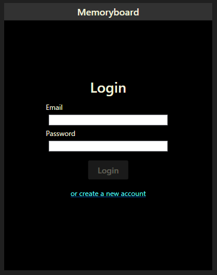
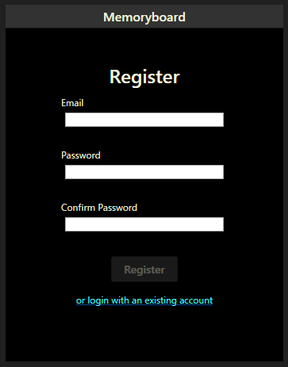
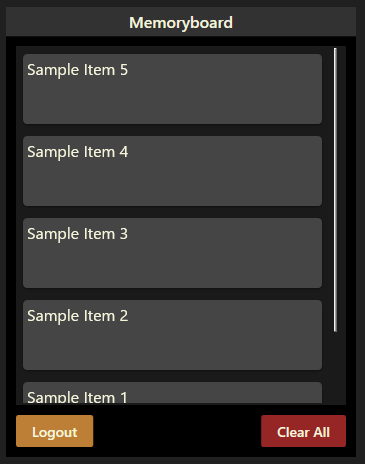

# Memoryboard Client

## Description
The Memoryboard client is a Windows-based clipboard management application that allows users to capture, store, and manage clipboard history. It features hotkey activation, SignalR-based real-time communication, and encryption for secure clipboard operations. Users can copy and paste multiple clipboard items, synchronize content with the Memoryboard API, and manage their clipboard content seamlessly. Designed for efficient multi-clipboard management, the client provides a simple yet powerful interface for clipboard operations.

## Requirements
.NET Desktop Runtime 8 is required for this application to launch. You can download it from [Microsoft's website](https://dotnet.microsoft.com/en-us/download/dotnet/8.0) if you don't already have it installed.

## How to Use
1. Clone the repository
1. Run ```ClientSetup/install.ps1``` (these are just the built files) in an admin Powershell window
1. The script will add Memoryboard to your Program Files (x86) and to your startup folder, and start the application
1. To bring up the UI, press the keys ```SHIFT + ALT + Z```
1. Click on an item in the UI, or anywhere outside it to hide the UI
1. When you click on an item, the application will attempt to paste the selected item in the last focussed window

## Gallery
### Login Screen


### Registration Screen


### Main Screen
